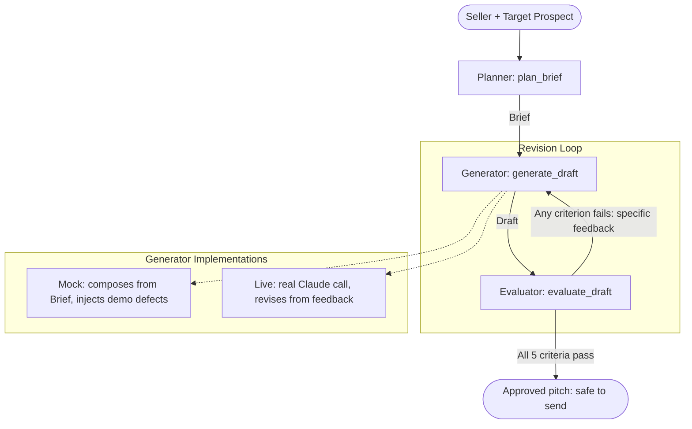

# gtm_eval

A flat, linear prototype of a GTM outreach pipeline built on the
**Planner → Generator → Evaluator** pattern. It takes a seller and a target
prospect, generates a personalized pitch, and runs that pitch through a strict
evaluator checkpoint that flags hallucinations and missing context before
anything could ship. A rejected draft loops back to the generator with specific
feedback and is rewritten until it passes or the round limit is hit.

The point of the prototype is the **evaluator**: the agent that writes the pitch
does not get to approve its own work. A separate checkpoint decides whether the
output is safe to send.

## Quick start

```bash
python -m streamlit run gtm_eval_ui.py
```

Open the printed Local URL (http://localhost:8501). Enter your company and a
prospect, pick a generator scenario, and click **Run pipeline**.

> If `streamlit` is not on your PATH, use `python -m streamlit ...` as above.
> Requires `streamlit` (tested with 1.56 on Python 3.14).

## Verify

```bash
python gtm_pipeline_test.py          # 13 self-running tests, no pytest needed
python -m pytest gtm_pipeline_test.py # also works if pytest is installed
```

A change is "done" when the tests pass, not when the code merely runs.

## Architecture Overview



The generator and evaluator are deliberately separate: the agent that writes the
pitch does not get to approve its own work.

### 1. Planner (`gtm_pipeline.py`)

- Takes the seller (company, product, value proposition) and the target prospect (name, description).
- Produces a `Brief`: the must-include list, the must-avoid list, grounding keywords, and the criteria the draft is judged against.
- A pure function of the inputs — no model call.

### 2. Generator (`gtm_pipeline.py`)

- Writes a pitch `Draft` against the `Brief`. One interface, two implementations:
  - **Mock (default):** composes the pitch deterministically from the brief and can inject known defects per scenario, so the evaluator has something real to catch and the loop something to fix. Reliable for demos and tests.
  - **Live (behind a flag):** a real Claude call writes the pitch and, on a revision, receives the previous draft plus the evaluator's feedback. Enable the **Use live agent** toggle after:

    ```bash
    pip install anthropic
    setx ANTHROPIC_API_KEY "sk-ant-..."   # then reopen the terminal
    ```

    Model defaults to `claude-sonnet-4-6` (override with `GTM_MODEL`). If the key or SDK is missing, it falls back to the mock automatically.

### 3. Evaluator (`gtm_pipeline.py`)

- Scores the draft against five hard-threshold criteria, each pass/fail with specific, evidence-backed feedback. All must pass for a draft to be approved:
  1. **Personalization** — names the prospect and references their stated situation.
  2. **Factual grounding** — no invented products or unverifiable statistics (the hallucination guard).
  3. **Correct offering** — pitches the seller's actual product.
  4. **Call to action** — ends with a concrete next step.
  5. **Format** — has a subject line and stays within the word budget.
- The generator gets no vote; the evaluator alone decides whether a draft is done.

### 4. Feedback loop (`gtm_pipeline.py`)

- `run_pipeline` runs the Planner once, then cycles Generator → Evaluator each round.
- On failure, the evaluator's feedback is carried back to the generator through the round history; on success (or at `max_rounds`), the loop stops.

## Files

| File | Purpose |
| --- | --- |
| `gtm_pipeline.py` | Logic layer: planner, generator (mock + live), evaluator, loop. No UI dependency. |
| `gtm_eval_ui.py` | Thin Streamlit UI over the pipeline. |
| `gtm_pipeline_test.py` | Self-running tests for the pipeline. |
| `AGENTS.md` | Entry doc: how to run/verify, hard constraints, integration seams. |
| `PROGRESS.md` | Current state and next steps. |

## Integration seams

Two interfaces are kept deliberately clean so a real agent and a larger harness
can drop in:

1. **Generator swap** — `generate_draft(brief, history, scenario, use_live)`
   returns a `Draft`. Replace or extend the generator without touching the
   planner, evaluator, or loop.
2. **Evaluator state shape** — `evaluate_draft` returns an `Evaluation` made of
   `CriterionResult(id, label, passed, feedback)`. That shape is the contract to
   line up against another implementation.
