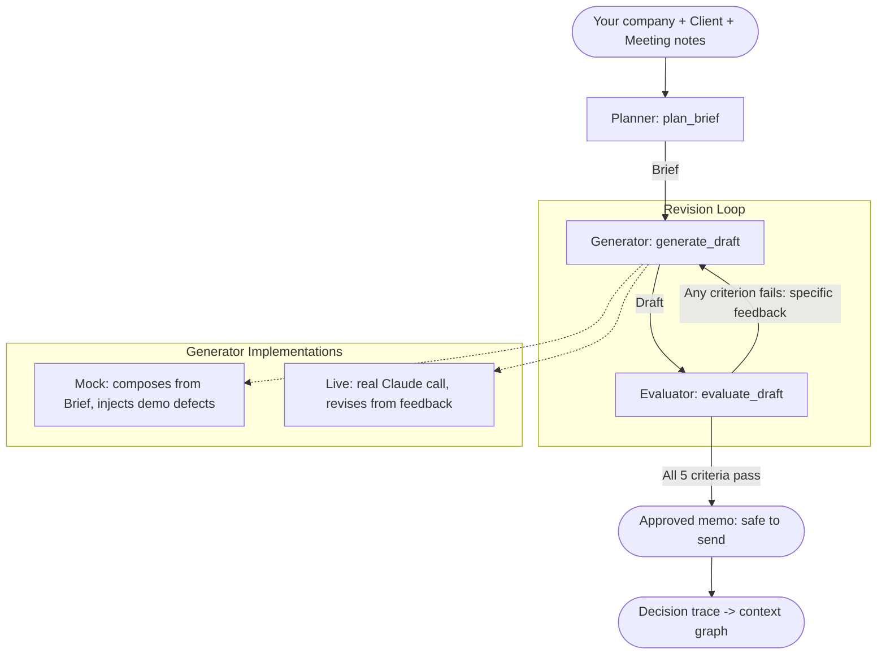

# gtm_eval

A flat, linear prototype of a post-meeting **client memo** pipeline, built on the
**Planner → Generator → Evaluator** pattern. After a booked meeting, it takes
your company, the client, and the meeting notes, drafts the follow-up memo, and
runs that memo through a strict evaluator checkpoint — above all that it stays
**grounded in what was actually discussed** (no invented commitments, dates, or
figures) — before it can be sent. A rejected memo loops back to the generator
with specific feedback and is rewritten until it passes or the round limit is hit.

The point of the prototype is the **evaluator**: the agent that writes the memo
does not get to approve its own work. A separate checkpoint decides whether the
output is safe to send. Every evaluation also emits a **decision trace** — the
durable record (entities, criteria, grounding, rationale) meant to feed a
context graph.

## Quick start

```bash
python -m streamlit run gtm_eval_ui.py
```

Open the printed Local URL (http://localhost:8501). Enter your company, the
client, and the meeting notes, pick a generator scenario, and click
**Run pipeline**.

> If `streamlit` is not on your PATH, use `python -m streamlit ...` as above.
> Requires `streamlit` (tested with 1.56 on Python 3.14).

## Verify

```bash
python gtm_pipeline_test.py          # 15 self-running tests, no pytest needed
python -m pytest gtm_pipeline_test.py # also works if pytest is installed
```

A change is "done" when the tests pass, not when the code merely runs.

## Architecture Overview



The generator and evaluator are deliberately separate: the agent that writes the
memo does not get to approve its own work.

### 1. Planner (`gtm_pipeline.py`)

- Takes your company, the client (company + contact), and the meeting notes.
- Produces a `Brief`: the must-include list, the must-avoid list, grounding terms and figures pulled from the notes, and the criteria the memo is judged against.
- A pure function of the inputs — no model call.

### 2. Generator (`gtm_pipeline.py`)

- Writes a memo `Draft` against the `Brief`. One interface, two implementations:
  - **Mock (default):** composes the memo deterministically from the brief and can inject known defects per scenario, so the evaluator has something real to catch and the loop something to fix. Reliable for demos and tests.
  - **Live (behind a flag):** a real Gemini call writes the memo and, on a revision, receives the previous draft plus the evaluator's feedback. Enable the **Use live agent** toggle after:

    ```bash
    pip install google-genai
    setx GEMINI_API_KEY "..."   # then reopen the terminal
    ```

    Model defaults to `gemini-2.5-flash` (override with `GEMINI_MODEL`). If the key or SDK is missing, it falls back to the mock automatically. Claude via AWS Bedrock is the eventual target; the swap lives entirely behind `_live_generate()`.

### 3. Evaluator (`gtm_pipeline.py`)

- Scores the memo against five hard-threshold criteria, each pass/fail with specific, evidence-backed feedback. All must pass for a memo to be approved:
  1. **Addressed to the client** — names the client company and contact.
  2. **Grounded in the meeting** — references what was actually discussed in the notes.
  3. **No fabrication** — every figure traces back to the notes; no invented commitments or products (the hallucination guard).
  4. **Clear next steps** — restates the agreed next steps.
  5. **Format** — has a subject line and stays within the word budget.
- Optional 6th criterion (live only): an **independent LLM faithfulness judge**
  (`judge_faithfulness`) — a separate Gemini call that reads the memo against the
  notes and flags semantic over-claims the figure check can't. Writer/checker
  separation; its tokens count toward the cost ceiling; non-blocking if deferred.
- The generator gets no vote; the evaluator alone decides whether a memo is done.

### 4. Feedback loop (`gtm_pipeline.py`)

- `run_pipeline` runs the Planner once, then cycles Generator → Evaluator each round.
- On failure, the evaluator's feedback is carried back to the generator through the round history; on success (or at `max_rounds`), the loop stops.

## Files

| File | Purpose |
| --- | --- |
| `gtm_pipeline.py` | Logic layer: planner, generator (mock + live), evaluator, loop. No UI dependency. |
| `gtm_eval_ui.py` | Thin Streamlit UI over the pipeline. |
| `gtm_pipeline_test.py` | Self-running tests for the pipeline. |
| `AGENTS.md` | Entry doc: how to run/verify, hard constraints, integration seams. |
| `PROGRESS.md` | Current state and next steps. |

## Integration seams

Interfaces kept deliberately clean so a real agent and a larger harness can
drop in:

1. **Generator swap** — `generate_draft(brief, history, scenario, use_live)`
   returns a `Draft`. Replace or extend the generator without touching the
   planner, evaluator, or loop.
2. **Evaluator state shape** — `evaluate_draft` returns an `Evaluation` made of
   `CriterionResult(id, label, passed, feedback)`. That shape is the contract to
   line up against another implementation.
3. **Grounding seam** — `ground(claim, brief)` returns a `GroundingResult`.
   Today it checks figures against the meeting notes; back it with the context
   graph later and nothing that calls it changes.
4. **Decision trace** — `build_decision_trace(...)` returns the durable record
   meant to append to the context graph's event clock.
